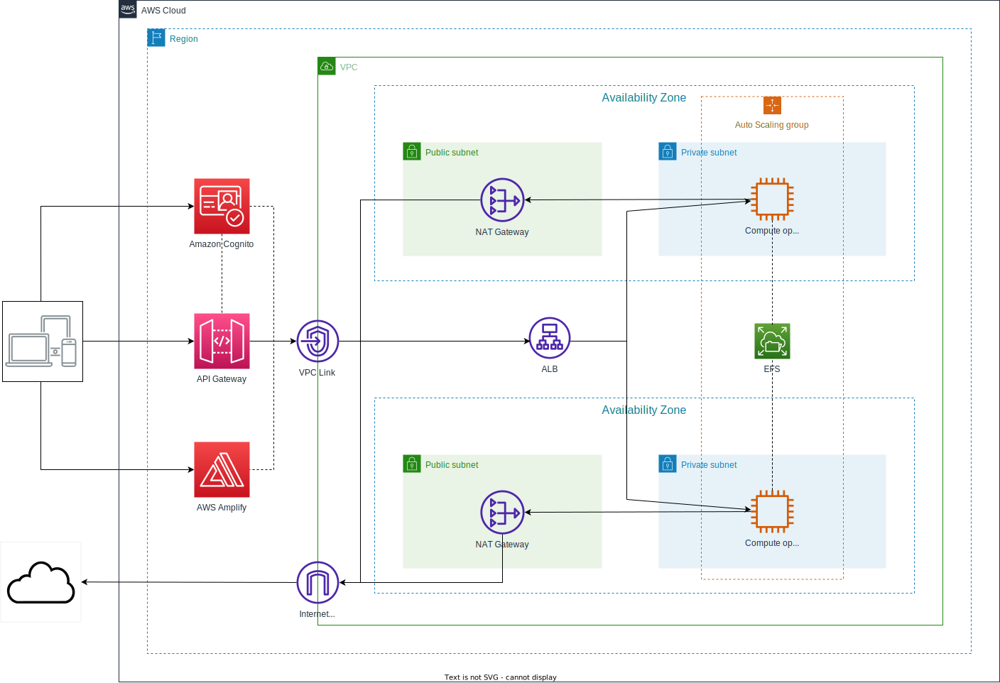

# Hands-on-cloud-computing
A biology faculty colleague has developed an exciting technology that he would like to do business with: by analyzing satellite shots, his model can predict the growth of flora in urban environments. 
He wants to build a **web application** to make the service available worldwide. 
During a coffee break, he described informally how he imagines the application: the user registers on the **paid portal**, draws an area of interest by navigating on a dynamic satellite map, sends the selected region images for
processing with the number of years to predict and the result will appear on the same map as an
animated heatmap.
He also described the **model**, which is difficult for non-biologists to understand, but you comprehend it is very computationally expensive.
The colleague also managed to find a small loan to start the project; he asked you to take care of the IT part in exchange for a share in the company. 
After taking notes on the back of a McDonald's receipt, you accept and start working on the design of the infrastructure on AWS right away. 
Before leaving, you promise your friend that the next time you see each other,  you will also have provisioned the entire infrastructure, and you can work together on **installing the model**.

> Presentation: <a src = "https://studentiunimol-my.sharepoint.com/:p:/g/personal/a_daguanno1_studenti_unimol_it/EeF7jeptegRHoaFa4UXAtO0BM1GQh4xyAXjF0eo7cGQpIQ?e=OSd3Xn&nav=eyJzSWQiOjI3MywiY0lkIjoyMjgyMDY5MzQwfQ"> Power Point presentation <a>

# Install dependencies
ref: https://docs.aws.amazon.com/cdk/v2/guide/getting_started.html

> *cd iac* 

> *npm i*
## Project Architecture

## Bootstrapping and Deploy command
> npx cdk bootstrap aws://{AWS_ID_Account}/{region}

> npx cdk deploy